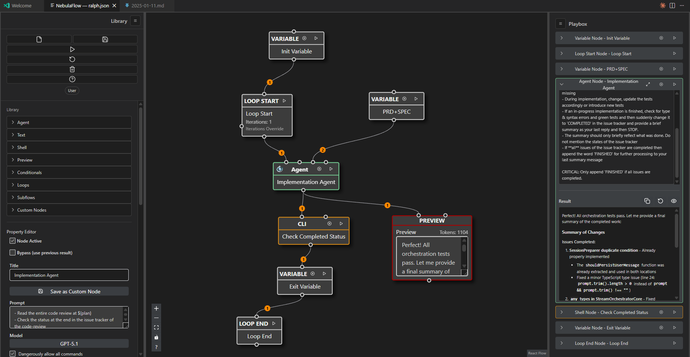

# NebulaFlow Workflow Editor (VS Code Extension)

A VS Code extension for visually designing and running developer workflows. Build graphs using node types (CLI, LLM, control-flow, preview, variables), execute them inside VS Code, and persist workflows/custom nodes per workspace.



## Project Focus: LLM Node

The LLM node runs via the Amp SDK and OpenRouter SDK. The editor acts as a visual wrapper around the SDK: it builds prompts from upstream node outputs and executes them with the SDK.

- SDK distribution: NebulaFlow vendors the SDK as `@prinova/amp-sdk` from a local tarball under `vendor/amp-sdk/`. No local path linking is required.
- Auth: Set `AMP_API_KEY` in your environment for Amp SDK and `OPENROUTER_API_KEY` for OpenRouter SDK so the LLM node can execute via the SDK.

### Workspace LLM configuration (`.nebulaflow/settings.json`)

- NebulaFlow can pass additional Amp SDK settings via a workspace-local JSON file at `.nebulaflow/settings.json` in the first workspace folder.
- The file should contain an `nebulaflow.settings` object that maps 1:1 to Amp SDK settings keys.

Example:

```jsonc
{
  "nebulaflow": {
    "settings": {
      "openrouter.key": "sk-or-...",
      "internal.primaryModel": "openrouter/xiaomi/mimo-v2-flash:free"
    }
  }
}
```

- `openrouter.key` configures the OpenRouter API key used by the SDK (the SDK will also read the `OPENROUTER_API_KEY` environment variable if set).
- `internal.primaryModel` provides a workspace-wide default model for LLM nodes.
- `openrouter.models` can be used to specify per-model configuration including `provider` for routing, `maxOutputTokens`, `contextWindow`, `isReasoning`, and `reasoning_effort`:

```jsonc
{
  "nebulaflow": {
    "settings": {
      "openrouter.models": [
        {
          "model": "openrouter/z-ai/glm-4.7-flash",
          "provider": "z-ai",
          "maxOutputTokens": 131000,
          "contextWindow": 200000,
          "temperatur": 0.5
        },
        {
          "model": "openrouter/openai/gpt-5.2-codex",
          "provider": "openai",
          "isReasoning": true,
          "reasoning_effort": "medium",
          "maxOutputTokens": 128000,
          "contextWindow": 400000
        }
      ]
    }
  }
}
```
- Per-node model selection in the Property Editor (Model combobox) always wins over the workspace default. If a node has no model, NebulaFlow falls back to `nebulaflow.settings["internal.primaryModel"]`, and if that is unset it falls back to the built-in default (`openai/gpt-5.1`).
- The Model combobox is populated from the Amp SDK `listModels()` API and also includes the configured workspace default (if not already present) and any OpenRouter models defined in `openrouter.models` settings, grouped by provider prefix (for example `openrouter/...`).

- **Category Label Display**: User-facing category names map to improved labels in the sidebar node palette ([WorkflowSidebar.tsx](file:///home/prinova/CodeProjects/nebulaflow/workflow/Web/components/sidebar/WorkflowSidebar.tsx#L44-L50)):
  - `llm` → `Agents`
  - `text-format` → `Text`
  - Unmapped categories pass through unchanged

## Features

### LLM Node and Chat Continuation

- LLM nodes run via the vendored Amp SDK (`@prinova/amp-sdk`) and OpenRouter SDK, building prompts from upstream node outputs and executing them inside a thread so later runs can reuse the same conversation.
- When an LLM node has an active `threadID`, the Right Sidebar shows a small chat panel that lets you send follow-up messages to that node; replies append to the existing assistant history and stream back into the Playbox, while drafts are scoped to the current execution run and cleared on workflow reset.

### Shell Node (CLI)

- Switch between Command (one-liner) and Script (multiline via stdin) in the Property Editor.
- Script mode preserves newlines; no here-docs or temp files needed.
- Stdin source can be set to parents-all, parent-index, or literal; optionally strip code fences and normalize CRLF.
- Env mapping exposes parent outputs as INPUT_1…N or custom names; use stdin for large payloads.
- Shell/flags: bash/sh/zsh (`set -e`, `set -u`, `set -o pipefail`), pwsh (`-NoProfile`, `-NonInteractive`, optional `-ExecutionPolicy Bypass`).
- Safety: Command mode uses denylist/sanitization by default (Safe). Script mode uses stdin semantics. Advanced disables sanitization (use approvals during authoring).
- Execution: Script mode uses spawn (buffered) by default; Command mode can use spawn (buffered) via a toggle. Output is aggregated and truncated when too large.
- Approvals: When enabled, the Right Sidebar shows an editable script/command and a structured summary (Mode, Shell, Safety, Stdin, Flags) before you approve.

### Visual Workflow Editor

- Node types: CLI, LLM, Preview, Text Input, Loop Start/End, Accumulator, Variable, If/Else
- Custom Nodes to store recuring node tasks into reusable units
- Support Sub-Flows to group nodes into reusable units
- Graph execution with ordered edges, token counting for previews, and abortion support
- Shell node enhancements:
  - Script mode (multiline) via in-memory stdin (no temp files)
  - Stdin sources (none, parents-all, parent-index, literal) with strip-fences and CRLF normalize
  - Env mapping (expose parents as INPUT_1…N, custom names, static env)
  - Shell selection and strict flags (bash/sh/zsh set -e/-u/pipefail; pwsh NoProfile/NonInteractive/ExecutionPolicy)
  - Spawn toggle for command mode; script mode uses spawn (buffered) by default
  - Structured approval preview (Mode, Shell, Safety, Stdin, Flags)
- Workspace persistence:
  - Workflows: `.nebulaflow/workflows/*.json`
  - Custom nodes: `.nebulaflow/nodes/*.json`
- Security protections:
  - Dangerous CLI prefixes blocked in command mode (e.g., `rm`, `sudo`, `chown`, etc.)
  - Command sanitization and abort handling; approvals available; Advanced mode disables sanitization

## Requirements

- VS Code ≥ 1.90.0
- Node.js ≥ 18 and npm ≥ 9
- macOS, Linux, or Windows

## Quick Start (Development)

1) Install dependencies

```bash
git clone https://github.com/PriNova/nebulaflow
cd nebulaflow
```

npm install
```

2) Build once (webview + extension)

```bash
npm run build
```

3) Launch the extension in VS Code

- Open this folder in VS Code
- Run and Debug: "Launch Extension (Desktop)" (F5)
  - This uses the `dev: start-webview-watch` task to watch webview assets

4) Open the editor UI

- In the Extension Development Host window, run the command: "NebulaFlow: Open Workflow Editor"

If you see a message about missing webview assets, run `npm run build` or start the watcher via the launch config and try again.

## Development Workflow

- One-shot builds:
  - Webview only: `npm run build:webview`
  - Extension only: `npm run build:ext`
- Watch webview (used by the VS Code launch config):
  - `npm run watch:webview`
- Typecheck (extension + webview types):
  - `npm run typecheck`
- Lint/Format (Biome):
  - Check: `npm run check`
  - Lint: `npm run lint`
  - Auto-fix: `npm run biome` (also aliased as `npm run format`)

## Electron Build (Standalone App)

NebulaFlow can also be built as a standalone Electron application.

### Development

Run the Electron app in development mode (with hot reload for the webview):

```bash
npm run start:electron
```

### Building

To build the Electron main process:

```bash
npm run build:electron
```

### Packaging

To package the application for distribution (creates an executable in `dist/release`):

**Linux (AppImage):**
```bash
npm run pack:electron -- --linux
```

**Windows (Zip):**
```bash
npm run zip:win
```
(This builds an unpacked win32-x64 application and zips it, bypassing the need for Wine on Linux)

**macOS (DMG):**
```bash
npm run pack:electron -- --mac
```

## Scripts

```jsonc
{
  "build:webview": "vite build --config workflow/Web/vite.config.mts",
  "watch:webview": "vite build --watch --config workflow/Web/vite.config.mts --mode development",
  "build:ext": "node scripts/bundle-ext.mjs",
  "watch:ext": "node scripts/bundle-ext.mjs --watch",
  "watch": "node scripts/dev-watch.mjs",
  "typecheck": "tsc -p . && tsc -p workflow/Web/tsconfig.json",
  "biome": "biome check --apply --error-on-warnings .",
  "format": "npm run biome",
  "check": "npm run -s typecheck && npm run -s biome",
  "lint": "npm run biome",
  "build": "npm run -s typecheck && npm run -s build:webview && npm run -s build:ext",
  "package:vsix": "npm run -s build && rm -f dist/${npm_package_name}-${npm_package_version}.vsix && vsce package --out dist/${npm_package_name}-${npm_package_version}.vsix"
}
```

## Project Structure

```
├ src/
│  └ extension.ts                # Registers command, hosts the webview
├ workflow/
│  ├ Web/                        # React webview app (Vite) → dist/webviews
│  │  ├ workflow.html            # Webview HTML entry
│  │  ├ index.tsx / WorkflowApp.tsx
│  │  └ components/
│  │     ├ sidebar/              # Left/Right sidebars, PropertyEditor, actions
│  │     ├ graph/                 # Custom edge component, edge paths, validation
│  │     ├ nodes/                 # Node UI components (LLM, CLI, etc.)
│  │     ├ modals/               # Help, confirm delete, text editor, markdown preview
│  │     ├ shared/               # Reusable UI (Markdown, copy button, run buttons, logo)
│  │     └ subflows/             # Sub-flow UI components
│  ├ Application/                # Extension-side app layer (messaging, lifecycle)
│  │  └ messaging/               # Message handling and routing
│  ├ Core/                       # Pure types, models, validation
│  │  └ validation/              # Schema validation helpers
│  ├ DataAccess/                 # I/O adapters (FS, shell)
│  │  ├ fs.ts                    # Save/load workflows and custom nodes
│  │  └ shell.ts                 # Shell exec with abort/sanitization
│  ├ WorkflowExecution/          # Graph execution engine
│  │  ├ Application/             # Execution orchestration
│  │  ├ Core/                    # Execution logic (engine, graph sorting)
│  │  └ Shared/                  # Execution utilities
│  ├ WorkflowPersistence/        # Workspace persistence
│  ├ LLMIntegration/             # LLM node SDK integration
│  ├ Library/                    # Custom nodes library
│  ├ Subflows/                   # Sub-flow management
│  └ Shared/                     # Shared infrastructure
│     ├ Host/                    # Host services
│     ├ Infrastructure/          # Base infrastructure
│     └ LLM/                     # Shared LLM utilities
```

## Architecture

This repo follows a vertical slice style within the `workflow/` directory:

- **Web (UI)**: webview UI, user-initiated actions, and protocol mirror
  - Web slices under `workflow/Web/components/`:
    - `sidebar/` (left/right sidebars, PropertyEditor, actions)
    - `graph/` (custom edges, edge paths, edge validation)
    - `nodes/` (node UI components for LLM, CLI, control-flow, etc.)
    - `modals/` (help, confirm delete, text editor, markdown preview)
    - `shared/` (reusable UI: Markdown, copy button, run buttons, spinning logo)
    - `subflows/` (sub-flow UI components)
  - Path aliases for slices are defined in [tsconfig.json](file:///home/prinova/CodeProjects/nebulaflow/workflow/Web/tsconfig.json#L16-L23) and [vite.config.mts](file:///home/prinova/CodeProjects/nebulaflow/workflow/Web/vite.config.mts#L9-L17): `@graph/*`, `@sidebar/*`, `@modals/*`, `@nodes/*`, `@shared/*`.
- **Application**: request/message handling, command orchestration, and lifecycle management
- **Core**: pure types/models and validation helpers
- **DataAccess**: file system and shell adapters for persistence and process execution (script mode + spawn/streaming)
- **WorkflowExecution**: graph execution engine with node runners for each node type
- **WorkflowPersistence**: workspace persistence layer
- **LLMIntegration**: LLM node SDK integration and workspace configuration
- **Library**: custom nodes library management
- **Subflows**: sub-flow management
- **Shared**: shared infrastructure (Host, Infrastructure, LLM utilities)

Execution flow:

1. User opens the editor and edits a graph in the webview
2. Webview posts messages (save, load, execute, token count) to the extension
3. Extension validates, persists, and executes nodes in a safe order and in parallel if possible
4. Status/results stream back to the webview for display

## Persistence

- Workflows are JSON files saved under `.nebulaflow/workflows/` (versioned `1.x`)
- Custom nodes are JSON files saved under `.nebulaflow/nodes/`
- Subflows are JSON files saved under `.nebulaflow/subflows/`
- The extension prompts for save/load locations scoped to the workspace

## Security

- CLI nodes:
  - Command mode (one-liners): disallowed prefixes and sanitization are applied; optional approval.
  - Script mode (multiline via stdin): runs via spawn; denylist is not applied, but approvals still work and strict flags are available.
  - Advanced mode: disables sanitization; use with approval during authoring. In non-interactive environments, disable approvals.
- Errors are surfaced via VS Code notifications; execution halts on errors/abort

## Troubleshooting

- LLM node error "Amp SDK not available":
  - The SDK is vendored.
- LLM node error "AMP_API_KEY is not set":
  - Set the environment variable before launching: `export AMP_API_KEY=<your-key>` or add to `.env`
- Webview assets don't load:
  - Run `npm run build` or start the Run and Debug configuration (which starts the watcher)
- Type errors:
  - Run `npm run typecheck` and address diagnostics
- Lint/format issues:
  - Run `npm run check` or `npm run biome`

## Contributing

- TypeScript strict mode; extension uses CommonJS; webview uses ESM + React
- Formatting and linting via Biome (`npm run check`, `npm run biome`)
- Keep core helpers pure; put side-effects at the boundaries (webview/application/data access)
- Prefer explicit type imports and small functions

## License

[MIT License](LICENSE)
